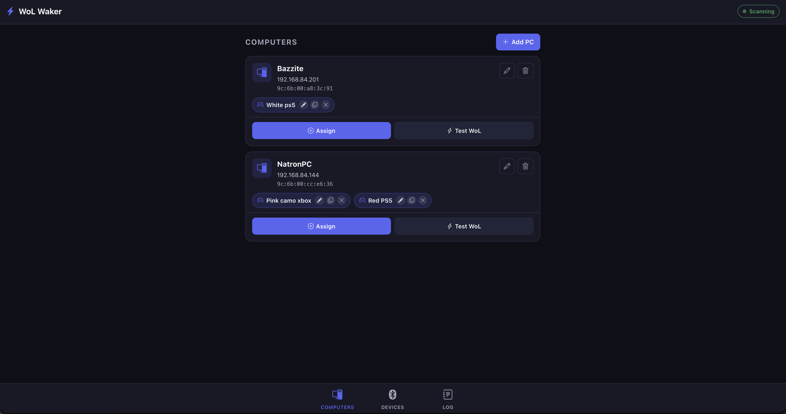

# WoL Waker

**Bluetooth-triggered Wake-on-LAN for your Raspberry Pi.**  
Power on any PC on your network the moment a controller wakes up — one Pi handles all your computers and controllers.

> **How it works:** The Pi continuously scans for Bluetooth advertisements (BLE and Classic). When a PS5 DualSense (`Create` + `PS`), Xbox Series controller, or any configured controller is triggered, the Pi immediately sends a Wake-on-LAN magic packet to every PC mapped to that controller.

---

## Screenshot



---

## Features

- **Automatic BT Detection** — Continuous BLE scanning via [bleak](https://github.com/hbldh/bleak); no pairing to the Pi required.
- **Classic Bluetooth Support** — Optional `hcitool scan` for older controllers (PS4, Xbox One).
- **Multi-PC & Multi-Controller** — Map any controller to any number of PCs; any PC can be woken by multiple controllers.
- **Controller Duplication** — Duplicate/copy controller mappings to other PCs with a single tap from badges or the assign modal dropdown.
- **Inline Renaming** — Rename controllers directly from PC cards with prefilled default names.
- **Pre-Filtered Tags** — Smart device filters default to Xbox and PS5 controllers on first view, with multi-tag selection.
- **Active & Inactive Views** — Live device countdown timers and complete history tracking.
- **High-Contrast Dark Mode** — WCAG AA compliant dark theme designed for mobile and desktop screens.
- **Network Discovery** — Scan your local network to auto-fill PC MAC and IP addresses.
- **Manual WoL Testing** — Send test magic packets directly from any PC card.
- **Real-Time UI** — WebSocket live state sync via Socket.IO; no page reloads needed.
- **Mobile-First PWA** — Responsive layout, bottom navigation, and pinnable to phone homescreens.
- **SQLite Storage** — Zero external database setup; all data lives in `wol_waker.db`.
- **systemd Service** — Runs reliably in the background and starts automatically on boot.

---

## Requirements

### Hardware
| Item | Notes |
|------|-------|
| Raspberry Pi 3, 4, or 5 | Built-in Bluetooth (Pi 3B+ or newer recommended) |
| Raspberry Pi 2 | Works with a standard USB Bluetooth 4.0+ dongle |
| Target PC(s) | Must have Wake-on-LAN (WoL) enabled in BIOS/UEFI and be on the same LAN |

### Software (Pi)
- Raspberry Pi OS Lite (Bookworm / Bullseye) or any Debian-based Linux distro
- Python 3.9+
- BlueZ (`bluetooth` + `bluez`)

### Target PC — Enabling Wake-on-LAN
1. Enter BIOS/UEFI → find **Wake on LAN** (often under Power Management / ACPI) → **Enable**.
2. On Windows: Device Manager → Network Adapter → Properties → Power Management → check *"Allow this device to wake the computer"*.
3. Note your PC's **MAC address** (found via router DHCP list, or `ip link` / `getmac` on the PC).

---

## Installation (Raspberry Pi)

```bash
# 1. Install system dependencies
sudo apt-get update
sudo apt-get install -y bluetooth bluez git python3 python3-pip python3-venv

# 2. (Optional) Allow arp-scan without sudo for faster network PC discovery
sudo apt-get install -y arp-scan
sudo chmod +s /usr/sbin/arp-scan

# 3. Clone the repo
git clone https://github.com/YOUR_USERNAME/BlueToothLanWaker.git
cd BlueToothLanWaker

# 4. Create virtual environment and install dependencies
python3 -m venv venv
source venv/bin/activate
pip install -r requirements.txt

# 5. Add the pi user to the bluetooth group
sudo usermod -a -G bluetooth pi

# 6. Test run
python app.py
```

The web UI will be available at `http://<pi-ip>:8080` (or configured port) on your local network.

---

## Running as a systemd Service

```bash
# Copy the service file
sudo cp wol-waker.service /etc/systemd/system/

# Reload systemd, enable, and start the service
sudo systemctl daemon-reload
sudo systemctl enable wol-waker
sudo systemctl start wol-waker

# Check live status & logs
sudo systemctl status wol-waker
sudo journalctl -u wol-waker -f
```

The service will automatically start on boot and restart if interrupted.

---

## Local Development (macOS / Linux)

```bash
git clone https://github.com/YOUR_USERNAME/BlueToothLanWaker.git
cd BlueToothLanWaker

python3 -m venv venv
source venv/bin/activate
pip install -r requirements.txt

python app.py
```

Open `http://localhost:8080` in your browser.

> **macOS note:** On macOS 12+, CoreBluetooth returns randomized UUIDs instead of hardware MAC addresses. All UI, mapping, and WoL features work normally for testing. When deployed to the Pi, real MAC addresses are used.

---

## Configuration

Environment variables:

| Variable | Default | Description |
|----------|---------|-------------|
| `PORT` | `8080` | Web UI port |
| `INACTIVE_TIMEOUT` | `60` | Seconds after last detection before a device goes inactive and WoL can re-trigger |
| `DB_PATH` | `wol_waker.db` | Path to SQLite database file |
| `SECRET_KEY` | `wol-waker-dev-key` | Flask secret key |

**Systemd override example:**
```ini
# /etc/systemd/system/wol-waker.service.d/override.conf
[Service]
Environment="PORT=8080"
Environment="INACTIVE_TIMEOUT=60"
```

---

## Usage Guide

### 1 — Add your PC(s)
1. Open the app → **Computers** tab → **Add PC**.
2. Enter a name (e.g. "Gaming PC" or "Bazzite").
3. Enter the PC's network adapter **MAC address**.
4. Optionally enter the IP address, or tap **Scan network** to discover devices automatically.
5. Tap **Save**.

### 2 — Register your Controller(s)
Trigger your controller's pairing / broadcast signal:
- **PS5 DualSense:** Hold `Create` + `PS` button until the lightbar rapidly flashes.
- **Xbox Series X/S:** Press the pair button or Xbox button.
- **Other Controllers:** Put into pairing mode.

The Pi will detect the controller and register it in the **Bluetooth Devices** tab.

### 3 — Assign Controllers to PCs
- Tap **Assign** on any PC card to select which controllers wake that computer.
- Use the **Add controller from another PC** dropdown to quickly copy a controller already assigned to another computer.
- On any controller badge on a PC card:
  - ✏️ **Edit:** Rename the controller (e.g. prepend "White " or append " 2").
  - 📋 **Copy:** Duplicate the controller to another PC with one click.
  - ✕ **Remove:** Unassign from this PC.

### 4 — Test Wake-on-LAN
Tap **Test WoL** on any PC card to verify that your PC wakes up on command.

### 5 — Pin to Homescreen (PWA)
- **iOS:** Open in Safari → Share → **Add to Home Screen**.
- **Android:** Open in Chrome → Menu → **Add to Home screen** / **Install app**.

---

## License

MIT
