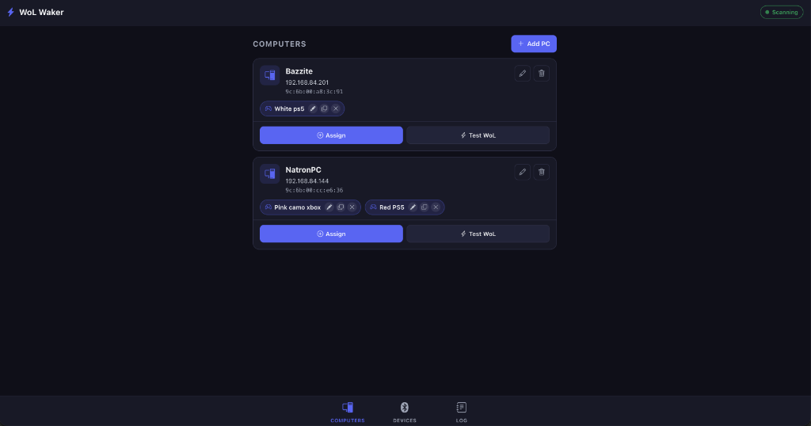

# WoL Waker

**Bluetooth-triggered Wake-on-LAN for your Raspberry Pi.**
Press a controller's pairing button — or click a pocket-sized BLE beacon — and the Pi instantly powers on any PC on your network. One Pi handles all your computers and all your triggers.



---

## What it does

A Raspberry Pi sits on your network and continuously scans for Bluetooth signals — both **Classic Bluetooth** (game controllers) and **Bluetooth Low Energy** (beacons). When a trigger you've mapped is detected, the Pi immediately sends a Wake-on-LAN magic packet to every PC linked to that trigger.

Two kinds of triggers are supported out of the box:

| Trigger | Radio | How you fire it |
|---------|-------|-----------------|
| **Game controller** (PS5 DualSense, PS4, Xbox) | Bluetooth Classic | Put the controller in pairing mode |
| **BLE beacon** (e.g. Blue Charm BC011 Pro iBeacon) | Bluetooth LE | Click the beacon's button |

Map any trigger to any number of PCs, and any PC can be woken by multiple triggers — e.g. a controller in the living room and a keychain beacon by the front door both waking the same machine.

---

## Features

- **Dual-radio detection** — Continuous BLE scanning via [bleak](https://github.com/hbldh/bleak) *and* Classic Bluetooth inquiry, so both beacons and controllers are caught.
- **Reliable beacon detection** — Forces BlueZ `DuplicateData=True` so stationary beacons (stable RSSI, repeating payload) aren't silently deduplicated. See [How it works](#how-it-works).
- **Multi-PC & multi-trigger** — Map any trigger to any number of PCs; any PC can be woken by several triggers.
- **Trigger duplication** — Copy a mapping to another PC with a single tap from a badge or the assign dropdown.
- **Inline renaming** — Rename triggers directly from PC cards (e.g. "White PS5", "Red PS5", "Pink camo Xbox").
- **Pre-filtered device tags** — Smart filters default to Xbox/PS5 controllers on first view, with multi-tag selection.
- **Active / inactive views** — Live countdown timers and full detection history.
- **Network discovery** — Scan your LAN to auto-fill a PC's MAC and IP.
- **Manual WoL testing** — Send a test magic packet from any PC card.
- **Real-time UI** — WebSocket live sync via Socket.IO; no page reloads.
- **Mobile-first PWA** — Responsive layout, bottom navigation, pinnable to a phone home screen.
- **Zero-setup storage** — All data in a local SQLite file (`wol_waker.db`).
- **systemd service** — Runs in the background and starts on boot.

---

## Requirements

### Hardware
| Item | Notes |
|------|-------|
| Raspberry Pi 3 / 4 / 5 | Built-in Bluetooth (Pi 3B+ or newer recommended) |
| Raspberry Pi 2 | Works with a USB Bluetooth 4.0+ dongle |
| Target PC(s) | Wake-on-LAN enabled in BIOS/UEFI, wired to the same LAN |
| (Optional) BLE beacon | Any BLE beacon with a fixed MAC and a button trigger, e.g. Blue Charm BC011 Pro |

> **Wired vs Wi-Fi:** Wake-on-LAN is only reliable over Ethernet. Most NICs will not wake from sleep over Wi-Fi.

### Software (Pi)
- Raspberry Pi OS (Bookworm / Bullseye) or any Debian-based Linux
- Python 3.9+
- BlueZ (`bluetooth` + `bluez`)

### Enabling Wake-on-LAN on the target PC
1. **BIOS/UEFI** → find **Wake on LAN** (often under Power Management / ACPI / ErP) → **Enable**.
2. **NIC driver:**
   - *Windows:* Device Manager → Network Adapter → Properties → Power Management → check *"Allow this device to wake the computer"* (and enable "Wake on Magic Packet" under Advanced).
   - *Linux:* `sudo ethtool <iface> | grep Wake-on` — if it shows `d`, enable with `sudo ethtool -s <iface> wol g` (persist via your network config).
3. Note the PC's **MAC address** (router DHCP list, or `ip link` / `getmac`).

---

## Installation (Raspberry Pi)

```bash
# 1. System dependencies
sudo apt-get update
sudo apt-get install -y bluetooth bluez git python3 python3-pip python3-venv

# 2. (Optional) arp-scan without sudo for faster network PC discovery
sudo apt-get install -y arp-scan
sudo chmod +s /usr/sbin/arp-scan

# 3. Clone
git clone https://github.com/YOUR_USERNAME/BlueToothLanWaker.git
cd BlueToothLanWaker

# 4. Virtualenv + dependencies
python3 -m venv venv
source venv/bin/activate
pip install -r requirements.txt

# 5. Let the pi user use Bluetooth
sudo usermod -a -G bluetooth pi

# 6. Test run
python app.py
```

The web UI is served at `http://<pi-ip>:8081` on your local network.

---

## Running as a systemd service

```bash
sudo cp wol-waker.service /etc/systemd/system/
sudo systemctl daemon-reload
sudo systemctl enable wol-waker
sudo systemctl start wol-waker

# Live status & logs
sudo systemctl status wol-waker
sudo journalctl -u wol-waker -f
```

The service starts on boot and restarts on failure.

---

## Configuration

Environment variables (set them in a systemd override, see below):

| Variable | Default | Description |
|----------|---------|-------------|
| `PORT` | `8081` | Web UI port |
| `DB_PATH` | `wol_waker.db` | Path to the SQLite database file |
| `SECRET_KEY` | `wol-waker-dev-key` | Flask secret key |
| `ENABLE_CLASSIC_BT` | `1` | Classic Bluetooth inquiry loop (required for controllers). Set `0` for BLE-only. |
| `CLASSIC_BT_INTERVAL` | `20` | Seconds between Classic inquiry passes. Higher = more radio time for BLE beacons. |

**Re-trigger cooldown (`INACTIVE_TIMEOUT`)** is a constant near the top of `app.py`:

```python
INACTIVE_TIMEOUT = 10   # seconds a trigger stays "active" after last detection
```

A trigger fires WoL on the transition from *not-seen → seen*, then won't fire again until it has been *absent* for `INACTIVE_TIMEOUT` seconds (this is what prevents a continuously-broadcasting device from waking your PC every second). Increase it for a longer cooldown; decrease it to re-fire sooner.

**Systemd override example:**
```ini
# /etc/systemd/system/wol-waker.service.d/override.conf
[Service]
Environment="PORT=8081"
Environment="CLASSIC_BT_INTERVAL=20"
```

---

## Usage guide

### 1 — Add your PC(s)
Open the app → **Computers** → **Add PC**. Enter a name (e.g. "Bazzite"), the PC's network-adapter **MAC address**, and optionally its IP — or tap **Scan network** to discover it. Save.

### 2 — Register a trigger
Fire the trigger once so the Pi sees it; it then appears under the **Devices** tab, ready to assign:
- **PS5 DualSense:** hold `Create` + `PS` until the lightbar rapidly flashes.
- **Xbox (Series / One):** press the pair button, or the Xbox button.
- **PS4 DualShock:** hold `Share` + `PS` until the lightbar flashes.
- **BLE beacon:** click the button (see [beacon setup](#setting-up-a-ble-beacon-trigger) below).

### 3 — Assign triggers to PCs
- Tap **Assign** on a PC card to pick which triggers wake it.
- Use **Add controller from another PC** to copy a trigger already assigned elsewhere.
- On any trigger badge: ✏️ rename · 📋 copy to another PC · ✕ unassign.

### 4 — Test Wake-on-LAN
Tap **Test WoL** on a PC card to verify it wakes on command (isolates PC-side WoL config from Bluetooth detection).

### 5 — Pin to home screen (PWA)
- **iOS:** Safari → Share → **Add to Home Screen**.
- **Android:** Chrome → Menu → **Add to Home screen / Install app**.

---

## Setting up a BLE beacon trigger

A BLE beacon (e.g. **Blue Charm BC011 Pro**) makes a great "press to wake" button. The key is to configure it so it is **silent when idle and only broadcasts on a button press** — otherwise a continuously-advertising beacon would either fire once and never re-arm, or wake your PC constantly.

Using the **KBeaconPro** app:

1. Connect to the beacon (default password is often `0000000000000000`).
2. Open **SLOT0** (the iBeacon slot):
   - **Adv Period** ≈ `200 ms`
   - **Trigger only adv** = **YES**  ← makes the slot silent until triggered
   - Save.
3. Open **Trigger Command**:
   - **Trigger Type** → **Button single click** → Save → Return
   - **Trigger Action** = **Advertisement**
   - **Trigger Adv Slot** = **SLOT0**
   - **Trigger Adv Time** = `10` (seconds it broadcasts per click)
   - Save.
4. Make sure **no other slot** is broadcasting continuously (set them all to *Trigger only adv* or disable them).

Then register it in WoL Waker (step 2 above) and assign it to a PC. Because the beacon is silent between presses, each click is a clean *not-seen → seen* transition that fires WoL, and `INACTIVE_TIMEOUT` re-arms it afterward.

> **Battery:** In trigger-only mode the beacon sleeps ~99.99% of the time, so the advertising interval barely affects battery life — expect years on a normal usage pattern.

---

## How it works

- **Continuous BLE scan (bleak).** A single long-lived `BleakScanner` delivers advertisements to a detection callback. On Linux, WoL Waker sets the BlueZ discovery filter `DuplicateData=True`. bleak's default is `False`, which makes BlueZ *suppress repeated identical advertisements* from a stationary beacon (unchanging payload + stable RSSI) — so a fixed beacon would only surface every 10–30 s and most button presses would be missed. Forcing it `True` makes BlueZ deliver every advertisement. *(Background: [bleak #494](https://github.com/hbldh/bleak/issues/494).)*
- **Classic Bluetooth inquiry.** Game controllers pair over Bluetooth Classic (BR/EDR) and are found via inquiry (`hcitool scan`), not BLE. That loop runs on a gentle cadence (`CLASSIC_BT_INTERVAL`) so it shares the single radio with BLE without starving beacon detection.
- **Non-blocking hot path.** The detection callback does only in-memory work and hands all SQLite writes and Socket.IO broadcasts to a background worker thread, with throttled writes. This keeps the BLE event loop from stalling under a busy RF environment (which would otherwise drop advertisements).
- **Edge-triggered firing with re-arm.** A trigger fires once on *not-seen → seen*; a background sweep expires it after `INACTIVE_TIMEOUT` seconds of absence, re-arming it for the next press.
- **Storage.** PCs, detected devices, and mappings live in SQLite (WAL mode) at `DB_PATH`.

---

## Local development (macOS / Linux)

```bash
git clone https://github.com/YOUR_USERNAME/BlueToothLanWaker.git
cd BlueToothLanWaker
python3 -m venv venv
source venv/bin/activate
pip install -r requirements.txt
python app.py
```

Open `http://localhost:8081`.

> **macOS note:** macOS CoreBluetooth returns randomized UUIDs instead of hardware MAC addresses, so beacon/controller MACs won't match what the Pi sees — but the UI, mapping, and WoL features all work for development. Real MACs are used on the Pi (BlueZ).

---

## Troubleshooting

| Symptom | Likely cause / fix |
|---------|--------------------|
| Beacon detected intermittently | Confirm `DuplicateData=True` is active (Linux) and the beacon is in **trigger-only** mode; check `journalctl -u wol-waker -f` for detections. |
| Controllers not detected | Ensure `ENABLE_CLASSIC_BT=1` and `hcitool` is installed; controllers must be in pairing mode. |
| Beacon fires WoL constantly | Beacon is broadcasting continuously — set **Trigger only adv = YES** so it's silent between presses. |
| "WoL sent" in logs but PC doesn't wake | PC-side WoL config: enable Wake-on-LAN in BIOS and the NIC driver; use a wired connection. |
| Beacon press occasionally missed while a controller is pairing | Single-radio contention — raise `CLASSIC_BT_INTERVAL` (e.g. `30`) or lengthen the beacon's Trigger Adv Time. |

---

## License

MIT
